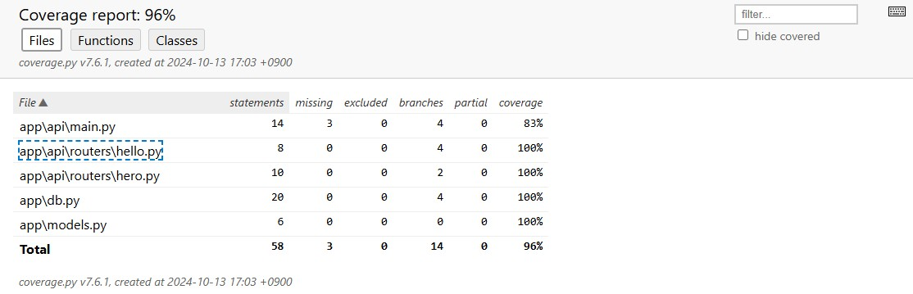
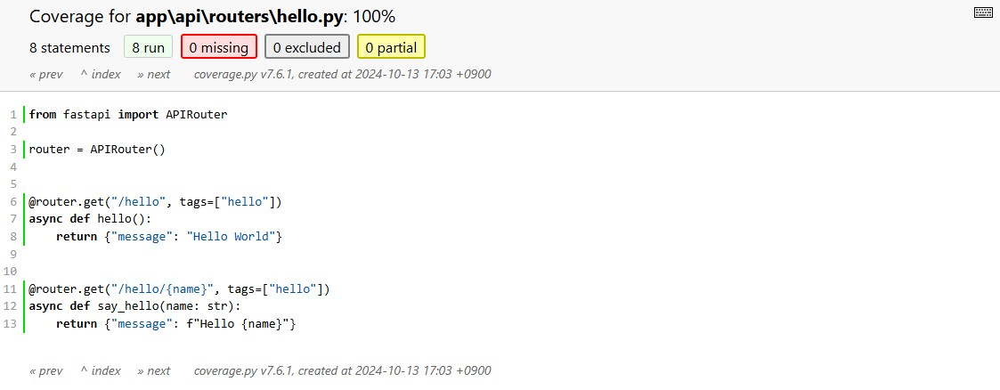
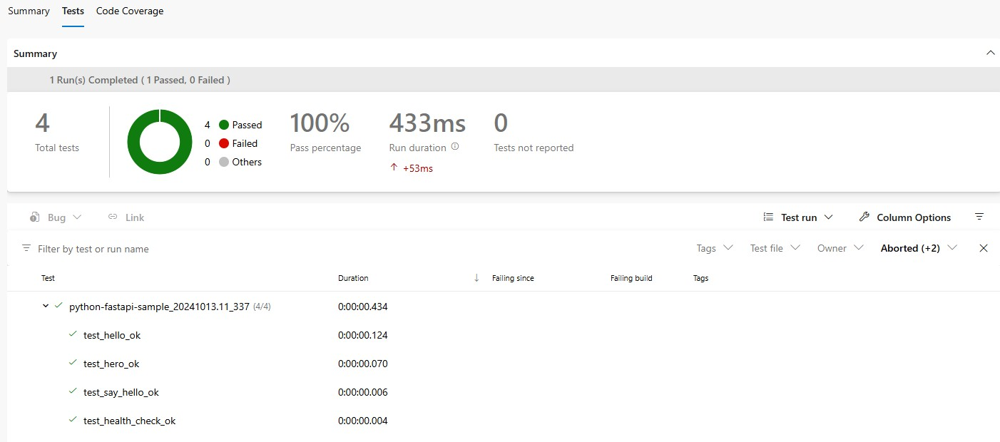
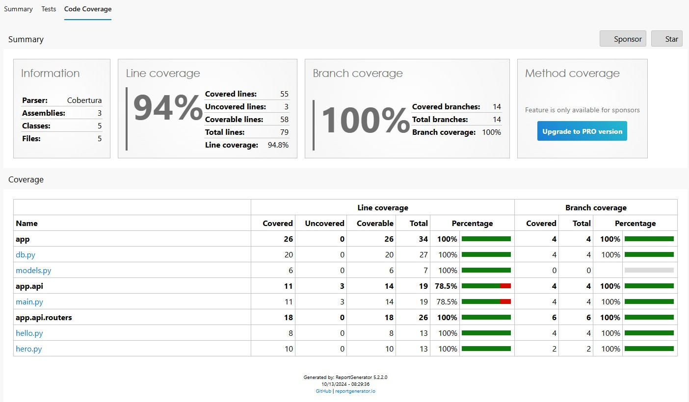

# python-fastapi-sample
Python + FastAPI + pytest のサンプル

## Feature
- Python 3.12
- FastAPI
- pytest
- SQLite
- Azure DevOps

## Settings
- venv、及び SQLite を初期設定します。
    - SQLite は、プロジェクトルート > `fastapi-sample.db` になります。
    - venv は、プロジェクト > `.venv` になります。

```ps1
PS > .\init.ps1
```

## Test
- pytest による単体テストの実行、カバレッジの取得を行います。
    - テスト結果は、プロジェクトルート > `test_result` に出力します。

```ps1
PS > .\test.ps1
```

- ↓ カバレッジレポートのイメージ





## PipeLine (Azure DevOps)
- `azure-pipelines.yml` を Azure DevOps で PipeLine に登録します。

- ↓ Azure DevOps のテスト結果、カバレッジレポートのイメージ




